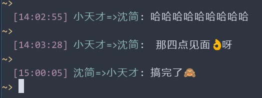

# wechat-terminal
A terminal wechat based on itchat, for my personal use.

Create a folder named `files` before running `main.py`

Wechat is a disgusting app but I can't get rid of it.

I hate GUI, I hate to be distracted by notifications 'Moments', 'Mini Programs' and 'Official Accounts', I hate to install useless features on my phone that I don't care about and I don't need. All those useless stuff will run in the background of my android phone, draining my battery life and memory.

Wechat 7.0.22 (Dec.2020) apk: 172 MB

Wechat 6.5.23 (Jan.2018) apk: 52  MB

Wechat 7.0.22 (Dec.2020) apk: 31  MB

Debian netinst CD image: 150-300 MB

# Screenshots

# Todo
- [ ] Friendly file sending cli
- [ ] Edit text in popup vim terminal
- [ ] Pinned friend list + recent friend list

# Useful Links
## Official

https://itchat.readthedocs.io/zh/latest/api/

https://github.com/littlecodersh/ItChat

https://itchat.readthedocs.io/zh/latest/

## Example

https://github.com/lim1942/cmd_wechat

https://github.com/oneatletico/cmd-wechat-terminal

https://github.com/aijialin/wechatManager

